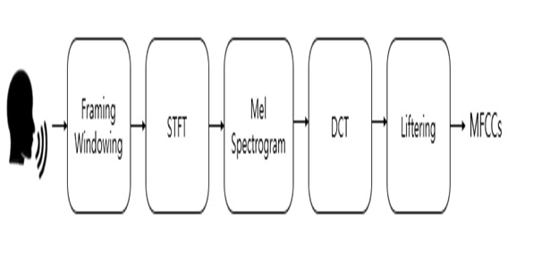
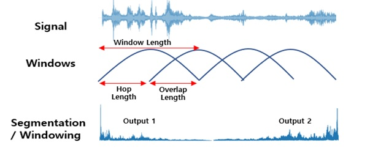

# Speaker-Recognition(화자 인식)
 사람의 음성의 특징을 추출하여 인식하는 화자 인식(Speaker Recognition) 기술은 특정 문장의 사용에서의 인식에 따라 문장 종속(Text dependent)방식과 문장 독립(Text Independent)방식으로 구분된다. 문장 종속방식은 한 사람 목소리의 고유한 개별 특성을 학습함으로써 작동하고, 화자 등록 과정과 검증 과정의 음성의 내용이 동일하기 때문에 높은 정확도를 얻을 수 있다. 반대로 문장 독립방식은 불특정 다수 화자의 음성을 인식하도록 개발되고, 검증 과정에서의 음성의 내용이 등록한 음성의 내용과 무관하기에 상대적으로 높은 정확도를 얻기 힘들다. 
    
## MFCC
<p>  
  
</p>
<p>< 그림 1 : MFCC ></p>   
 `MFCC`는 Mel Frequency Cepstrum Coefficient의 약자로서 음성인식 분야에서 널리 사용되는 알고리즘이다.   
MFCC는 소리의 특징을 추출하는 알고리즘으로서 입력받은 소리를 일반적으로 20ms-40ms정도의 작은 프레임으로 쪼개는 과정을 거치고 이러한 프레임들의 스펙트럼을 분석하여 특징을 추출하는 기법이다.   
MFCC를 이용한 Features 추출은 음정이 변해도 어느 정도 일정하다는 장점이 있기 때문에 음성인식에 효과적인 알고리즘이다.    
아래의 그림은 MFCC의 전체적인  과정이다.   
<p>  
  
</p>
<p>< 그림 2 : MFCC 동작 과정 ></p>  
 사람마다 개개인의 고유한 DNA 및 지문을 가지고 있듯이, 각 사람마다 목소리의 고유 주파수, 진폭 등이 다르다는 특성(MFCC)을 이용하여 개인의 신분을 확인 할 수 있는 화자 인식이 가능하다.   
본 프로젝트에서는 음성 전처리 과정을 MFCC를 사용해서 진행하였다
 </p>
 <p>
 STFT는 시간, 주파수와 음량 간의 상관관계를 손실하지 않고 특징을 추출 해내기 위해서 시간 구간별로 Fourier Transform 연산을 수행하는 알고리즘이다.
 본 논문에서 적용한 수치는 샘플링 레이트, Hop Length, n_mels, n_fft이고 샘플링 레이트는 이산적 신호를 얻기 위한 단위 시간당 샘플링 횟수를 뜻하고, Hop Length는 음성의 magnitude를 얼마나 겹처서 잘라서 보여주는 지를 뜻하고, n_mels는 주파수를 나눠주는 수이고, n_fft는 음성 프레임의 길이를 결정하는 것이다. 각 수치는 16,000, 256, 40, 512이다.
  
 </p>
 <p>< 그림 3 : STFT  ></p>  
## Project Structure
<p align="center">
  
</p>
<p align="center">< 그림 4 : CNN Model Structure ></p>  
## Data Collection
<p>
  <table>
    <tr>
      <th> Folder name </th>
      <th> Name </th>
      <th> Number of data </th>
    </tr>
    <tr>
      <td align="center">00</td>
      <td align="center">강은기</td>
      <td align="center">20</td>
    </tr>
    <tr>
      <td align="center">01</td>
      <td align="center">강은서</td>
      <td align="center">20</td>
    </tr>
    <tr>
      <td align="center">02</td>
      <td align="center">김나리</td>
      <td align="center">20</td>
    </tr>
    <tr>
      <td align="center">03</td>
      <td align="center">김엄지</td>
      <td align="center">20</td>
    </tr>
    <tr>
      <td align="center">04</td>
      <td align="center">김용준</td>
      <td align="center">20</td>
    </tr>
    <tr>
      <td align="center">05</td>
      <td align="center">윤동준</td>
      <td align="center">20</td>
    </tr>
    <tr>
      <td align="center">06</td>
      <td align="center">이성민</td>
      <td align="center">20</td>
    </tr>
    <tr>
      <td align="center">07</td>
      <td align="center">이재빈</td>
      <td align="center">20</td>
    </tr>
    <tr>
      <td align="center">08</td>
      <td align="center">정승화</td>
      <td align="center">20</td>
    </tr>
    <tr>
      <td align="center">09</td>
      <td align="center">주다영</td>
      <td align="center">20</td>
    </tr>
    <tr>
      <td align="center">10</td>
      <td align="center">주홍식</td>
      <td align="center">20</td>
    </tr>
  </table>
</p>
## Library
```python
import pyaudio                     # Record audio from mic
import wave                        # Read/Write .wav
import scipy                       # Use signal
import os                          # Access folder
import librosa                     # Calc mfcc
import librosa.display             # Display mfcc with matplotlib
import matplotlib.pyplot as plt    # Draw waveform
import tensorflow as tf            # Use tf
import keras                       # Use keras
import numpy as np
import pandas as pd
```
## Learning process
<p>
<table>  
  <tr>
    <th colspan="2">
      Learning process
    </th>
  </tr>  
  <tr>
    <td align="center"> 학습방법 1 </td>
    <td align="center"> 학습방법 2 </td>
  </tr>
  <tr>
    <td align="center"></td>
    <td align="center"></td>    
  </tr>
</table>
</p>
학습방법 1은 사전에 5개의 class에 대해서 학습을 진행한 다음 새로운 데이터를 포함해서 총 11개의 class에 대해서 재학습을 진행하는 방법이고   
학습방법 2는 새로운 데이터를 포함해서 총 11개의 class에 대해서 학습을 진행하는 방법이다.   
## Result
<p>
<table>  
  <tr>
    <th colspan="2">
      Result
    </th>
  </tr>  
  <tr>
    <td align="center"> 학습방법 1 </td>
  </tr>
  <tr>
    <td align="center"></td>    
  </tr>
  <tr>
    <td align="center"> 학습방법 2 </td>
  </tr>
  <tr>
    <td align="center"></td>    
  </tr>
</table>
</p>
<p>
전체적으로 각 class 별 정확도가 큰 차이가 나지 않지만 학습방법 1같은 경우    
학습방법 2보다 더 적은 학습 횟수와 시간을 가지기 때문에 추후에 사용하게 될 훈련 방법은    
사전에 미리 학습을 시킨 다음에 새로운 데이터가 들어올 경우 다시 재학습하는 방법을 사용하게 될 것이다.    
</p>
